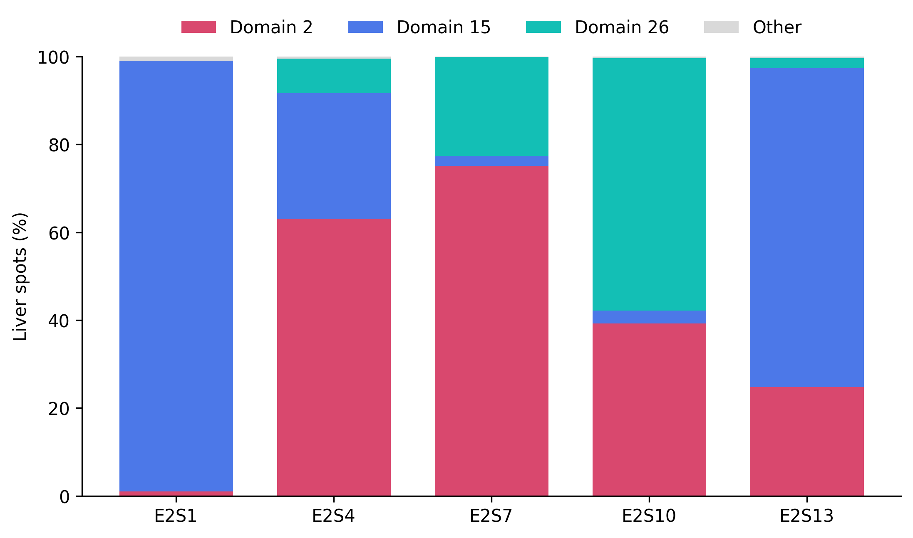
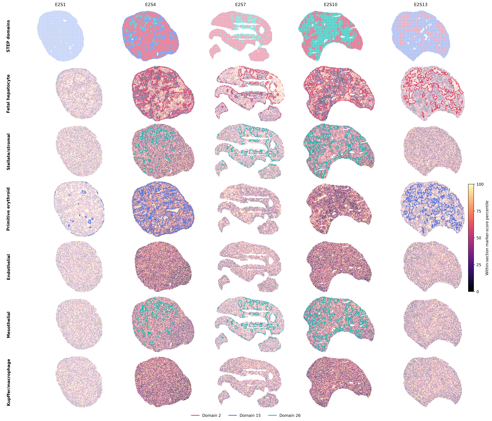
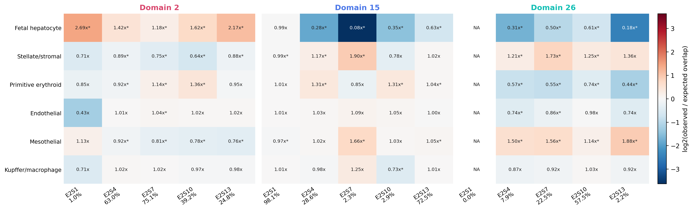
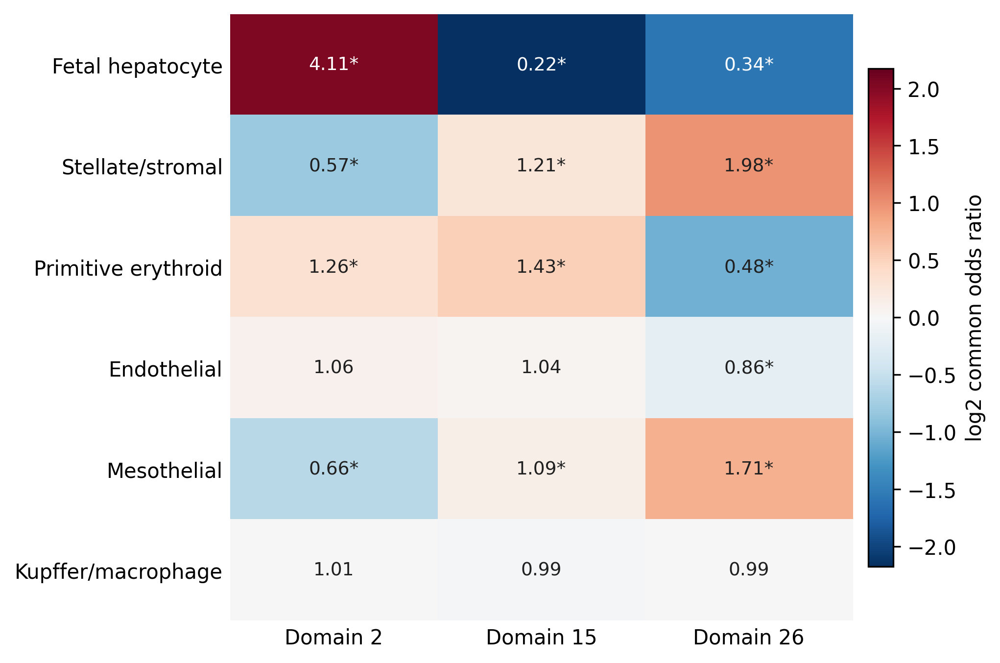
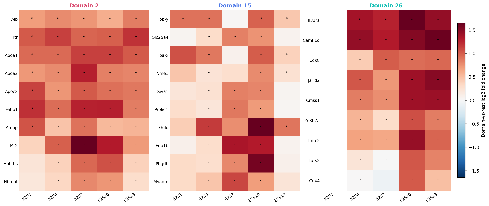
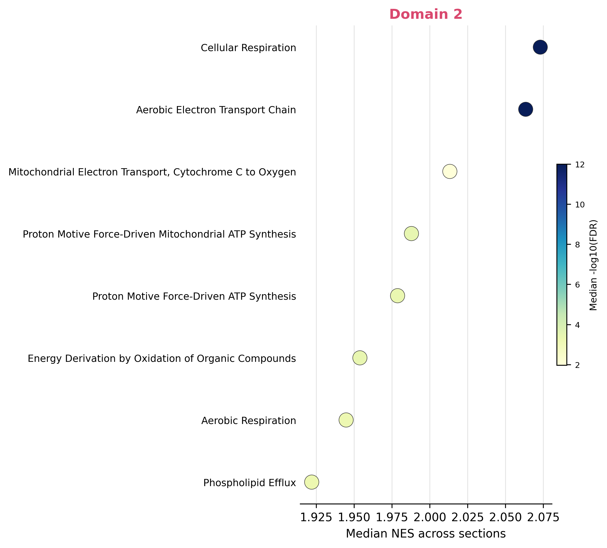
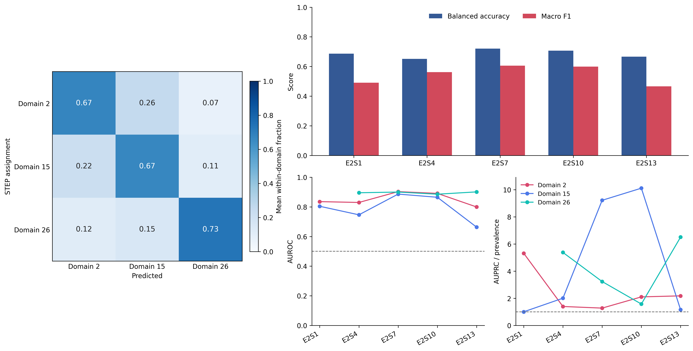
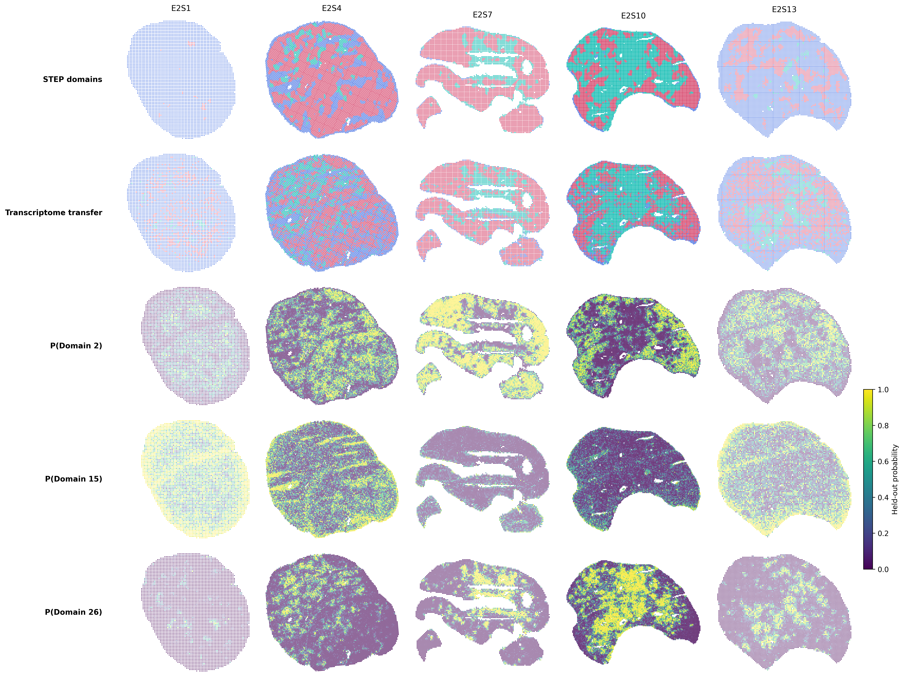
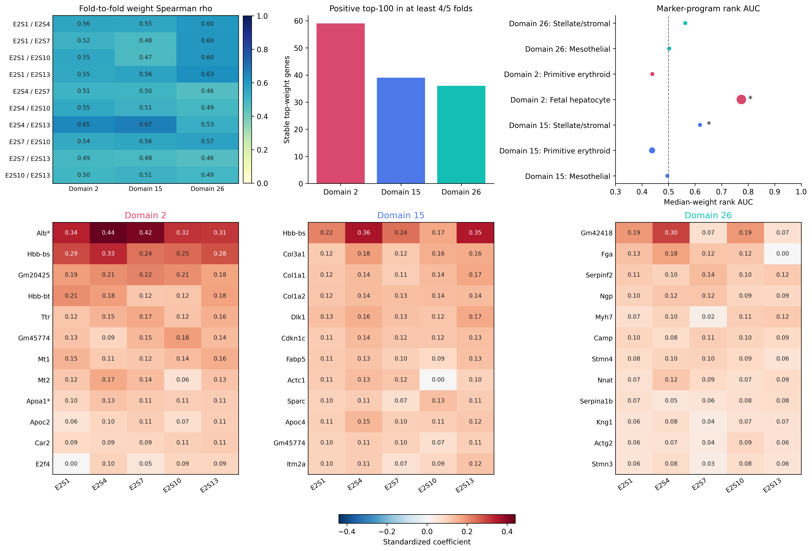

# Biological validation of STEP-resolved E16.5 liver domains

STEP resolved Domains 2, 15, and 26 within the manual Liver annotation of five MOSTA E16.5 sagittal sections. We evaluated whether these assignments carry reproducible transcriptomic signals across sections and whether their biological associations exceed the overlap expected from each domain's spot proportion.

## Domain composition across sagittal sections

| Section | Domain 2 (%) | Domain 15 (%) | Domain 26 (%) |
| --- | --- | --- | --- |
| E2S1 | 0.99 | 98.07 | 0.00 |
| E2S4 | 63.04 | 28.58 | 7.86 |
| E2S7 | 75.10 | 2.29 | 22.52 |
| E2S10 | 39.23 | 2.92 | 57.50 |
| E2S13 | 24.81 | 72.53 | 2.25 |

**Figure 1 | Section-specific composition of STEP domains within the manual Liver annotation.** Bars show the percentage of Liver spots assigned to Domains 2, 15, 26, or other STEP domains. The composition varies markedly among sagittal sections; E2S1 is nearly uniform, with 98.07% of Liver spots assigned to Domain 15.

## Literature-defined fetal-liver marker programs

Marker programs were fixed from primary fetal-liver studies before testing their association with STEP domains. Scores were computed with scanpy.tl.score_genes over the full measured gene set. Within each section, marker-high spots were defined as the top 15% of scores. The expected overlap with a domain was the number of marker-high spots multiplied by that domain's observed Liver-spot proportion.

| Program | Genes | Primary source |
| --- | --- | --- |
| Fetal hepatocyte | Hnf4a, Afp, Alb, Ahsg, Apoa1, Apoa2, Trf, Rbp4, Fgb, Fxyd1, Gjb1 | 10.1038/s41422-020-0378-6 |
| Stellate/stromal | Pdgfra, Ncam1, Dcn, Hgf, Lum, Pdgfrb, Col6a1, Col6a2 | 10.1038/s41422-020-0378-6 |
| Primitive erythroid | Kit, Gata1, Bpgm, Gypa, Hba-a1, Hba-x, Hbb-y, Hbb-bh1 | 10.1038/s41422-020-0378-6 |
| Endothelial | Kdr, Pecam1, Cdh5, Emcn, Eng, Esam, Flt4 | 10.1038/s41422-020-0378-6 |
| Mesothelial | Wt1, Upk3b, Pdpn, Krt7 | 10.1038/s41422-020-0378-6 |
| Kupffer/macrophage | Cd68, C1qa, C1qb, C1qc | 10.1038/s41422-020-0378-6 |

**Figure 2 | Spatial correspondence between STEP domains and literature-defined fetal-liver marker programs.** The first row shows STEP assignments within the manual Liver annotation. Subsequent rows show within-section percentiles of scanpy marker scores. Colored outlines visualize the domain-program pairs with a significant positive pooled association in Figure 4. Domain assignments occupying less than 5% of Liver spots in a section are left gray in the first row and are not outlined.

**Figure 3 | Section-level marker enrichment after accounting for domain spot proportions.** Each cell reports observed marker-high overlap divided by its composition-based expectation. The domain percentage is printed below each section. Asterisks denote two-sided Fisher tests passing BH-FDR across all tested section-domain-program combinations.

**Figure 4 | Cross-section marker associations.** Values are Mantel-Haenszel common odds ratios from section-specific 2 x 2 tables. Asterisks denote BH-FDR below 0.05 across the 18 pooled domain-program tests.

| Domain | Program | Observed / expected | Common OR (95% CI) | BH-FDR | Sections above expectation |
| --- | --- | --- | --- | --- | --- |
| Domain 2 | Fetal hepatocyte | 1.48 | 4.11 (3.85-4.39) | < 1e-300 | 5/5 |
| Domain 2 | Primitive erythroid | 1.09 | 1.26 (1.19-1.33) | 7.79e-15 | 2/5 |
| Domain 15 | Primitive erythroid | 1.10 | 1.43 (1.33-1.55) | < 1e-300 | 4/5 |
| Domain 15 | Stellate/stromal | 1.05 | 1.21 (1.12-1.30) | 2.40e-06 | 3/5 |
| Domain 15 | Mesothelial | 1.02 | 1.09 (1.01-1.18) | 0.044 | 4/5 |
| Domain 26 | Stellate/stromal | 1.32 | 1.98 (1.84-2.13) | < 1e-300 | 4/4 |
| Domain 26 | Mesothelial | 1.26 | 1.71 (1.59-1.84) | < 1e-300 | 4/4 |

Domain 2 showed the dominant fetal-hepatocyte association (common OR 4.11). Domain 15 was enriched for primitive-erythroid and stellate/stromal signals, whereas Domain 26 was enriched for stellate/stromal and mesothelial signals. For E2S1 Domain 15, which comprised 98.07% of Liver spots, observed-to-expected marker overlaps ranged from 0.974 to 1.010 after accounting for that domain proportion.

## Full-transcriptome differential expression and gene-set enrichment

Within each section, each domain was compared with the remaining Liver spots using a tie-corrected Wilcoxon rank-sum test over all genes detected in at least three spots; no highly variable-gene restriction was applied. Counts were normalized separately in each section to 10,000 counts per spot and log1p transformed. Gene-level P values were corrected by Benjamini-Hochberg within each section-domain contrast.

**Figure 5 | Repeated domain-associated expression differences across sections.** Values are domain-versus-rest log2 fold changes from the full-transcriptome tests. Asterisks denote within-contrast BH-FDR below 0.05. Up to ten repeat-supported genes per domain are displayed, ordered by the number of significant sections and then the median Wilcoxon score.

**Figure 6 | Recurrent GO Biological Process enrichment.** GSEA used signed Wilcoxon statistics with 1,000 gene-set permutations per section-domain contrast. Exact Wilcoxon ties were ordered deterministically by log2 fold change and gene name without crossing adjacent Wilcoxon scores. Terms qualify when enrichment is positive in every available section and FDR is below 0.05 in at least half of those sections. Up to eight qualifying terms per domain are plotted, ordered by the number of significant sections and then median NES; the table lists the first six.

| Domain | GO biological process | Median NES | Significant sections | Median FDR |
| --- | --- | --- | --- | --- |
| Domain 2 | Cellular Respiration | 2.07 | 4/5 | < 1e-300 |
| Domain 2 | Aerobic Electron Transport Chain | 2.06 | 4/5 | < 1e-300 |
| Domain 2 | Mitochondrial Electron Transport, Cytochrome C to Oxygen | 2.01 | 4/5 | 0.011 |
| Domain 2 | Proton Motive Force-Driven Mitochondrial ATP Synthesis | 1.99 | 4/5 | 3.54e-04 |
| Domain 2 | Proton Motive Force-Driven ATP Synthesis | 1.98 | 4/5 | 4.87e-04 |
| Domain 2 | Energy Derivation by Oxidation of Organic Compounds | 1.95 | 4/5 | 3.89e-04 |

Recurrent positive GO enrichment was detected for Domain 2, including cellular respiration, electron transport, ATP synthesis, heme metabolism, and lipid transport. Domains 15 and 26 did not meet this recurrent GSEA criterion. Their biological annotations are supported by the literature-defined marker-program associations above; cross-section transcriptome transfer is evaluated separately below.

## Cross-section transcriptome consistency

We tested whether the numerical domain labels correspond to transcriptomic identities that transfer between sections. In each of five folds, one complete section was excluded from feature selection and classifier fitting. Stable domain-associated genes were selected using only the other four sections, and a section- and class-balanced multinomial logistic-regression classifier was then applied to all held-out Liver spots assigned by STEP to Domains 2, 15, or 26. Coordinates, STEP embeddings, and labels from the held-out section were not used for feature selection or model fitting.

| Section | Spots | Balanced accuracy | Macro F1 |
| --- | --- | --- | --- |
| E2S1 | 4,710 | 0.687 | 0.490 |
| E2S4 | 13,215 | 0.651 | 0.562 |
| E2S7 | 7,191 | 0.720 | 0.606 |
| E2S10 | 12,848 | 0.707 | 0.600 |
| E2S13 | 8,016 | 0.667 | 0.466 |

| Domain | Tested sections | Median AUROC | Median AUPRC | Median AUPRC / prevalence | Median recall |
| --- | --- | --- | --- | --- | --- |
| Domain 2 | 5 | 0.835 | 0.829 | 2.11 | 0.679 |
| Domain 15 | 5 | 0.804 | 0.577 | 2.01 | 0.630 |
| Domain 26 | 4 | 0.897 | 0.577 | 4.31 | 0.723 |

Across the 45,980 out-of-fold spots, mean section-level balanced accuracy was 0.686. Median one-versus-rest AUROCs were 0.835, 0.804, and 0.897 for Domains 2, 15, and 26, respectively. In all 14 section-domain combinations that were present, more than half of the assigned spots were classified as the same domain using only the other sections.

As a label-alignment diagnostic, we enumerated all six one-to-one mappings between the domain identities present in each section and the three classifier outputs. The identity mapping was the unique best mapping in all five sections. Its mean balanced score was the unique maximum among all 7,776 joint section-level mappings (exact P = 1.29e-04). This null permutes domain identities at the section level; it does not shuffle spots or use spatial coordinates.

**Figure 7 | Transcriptome-only transfer of STEP Liver-domain identities to held-out sections.** The confusion matrix summarizes within-domain classification fractions averaged equally across sections. Bars report balanced accuracy and macro F1 for each held-out section. Curves report one-versus-rest AUROC and AUPRC relative to each domain's prevalence. The test includes 45,980 Liver spots assigned by STEP to Domains 2, 15, or 26; 199 Liver spots assigned to other domains are outside this three-class evaluation.

**Figure 8 | Spatial diagnostic of transcriptome-only held-out predictions.** The first two rows compare STEP assignments with labels predicted from the other four sections. The remaining rows show held-out class probabilities. Spatial coordinates are used only for this visualization and were not available to the classifier. For display, isolated connected components containing fewer than 20 Liver spots are omitted; all 45,980 spots in the three-class evaluation remain included in the reported metrics.

## Classifier-weight stability and interpretation

The held-out predictions above test whether domain identities transfer between sections. We separately examined whether the genes used by the five LOSO fits were stable and biologically interpretable. Coefficient vectors were aligned over the union of eligible model features; a gene absent from a fold-specific selected feature set was assigned weight zero. Across the ten fold pairs per domain, median Spearman correlations were 0.545, 0.513, and 0.549 for Domains 2, 15, and 26. Because each pair of fits shares three training sections, these values measure stability to leaving out one section and are not independent replications.

| Domain | Median fold-pair rho | Pairwise rho range | Stable top-weight genes | Supported marker enrichment | Stable supported marker genes |
| --- | --- | --- | --- | --- | --- |
| Domain 2 | 0.545 | 0.491-0.648 | 59 | Fetal hepatocyte | Alb, Apoa1, Ahsg, Trf, Afp, Fgb, Apoa2 |
| Domain 15 | 0.513 | 0.473-0.670 | 39 | Stellate/stromal, Primitive erythroid | Hbb-y, Hba-x |
| Domain 26 | 0.549 | 0.459-0.626 | 36 | None | None |

A stable top-weight gene was defined as having a positive top-100 coefficient in at least four of five models. This identified 59, 39, and 36 genes for Domains 2, 15, and 26. Against the complete eligible Liver-gene background, the Domain 2 coefficient ranking was enriched for the literature-defined fetal-hepatocyte program and its stable set contained Alb, Apoa1, Ahsg, Trf, Afp, Fgb, and Apoa2. The Domain 15 stable set contained the primitive-erythroid genes Hbb-y and Hba-x, while the full Domain 15 ranking was enriched for the stellate/stromal program. For Domain 26, neither prespecified marker program was significantly enriched in the coefficient ranking after BH correction, and neither overlapped the stable top-weight set. GO over-representation of stable weights was tested separately against all eligible Liver genes; after BH correction across all tested terms within each domain, Domain 26 was enriched for negative regulation of blood coagulation.

**Figure 9 | Classifier-weight stability and interpretation across leave-one-section-out fits.** The upper-left heatmap reports fold-pair Spearman correlations over the union of eligible model features, assigning zero to genes absent from a fold-specific feature set. Bars count genes with a positive top-100 coefficient in at least four folds. Marker-program rank AUC quantifies whether literature-defined programs with pooled domain associations in Figures 2-4 occur above other eligible genes in the median coefficient ranking; asterisks denote BH-FDR below 0.05 across all domain-program tests. The lower heatmaps show standardized coefficients for the 12 largest stable weights in each domain. Gene-label asterisks mark literature-defined marker genes from programs associated with that domain. This panel interprets the transfer classifier and is not an additional biological validation dataset.

## Interpretation

The evidence supports biologically structured, section-varying transcriptomic organization within the coarse Liver annotation. Domain 2 has a strong fetal-hepatocyte identity. Domain 15 is associated with primitive-erythroid and weaker stromal signals, whereas Domain 26 is associated with stromal and mesothelial signals. Literature-defined marker programs provide biological annotation, and full-transcriptome differential expression and GSEA provide broader expression and pathway context. The strict leave-one-section-out transcriptome transfer directly tests whether the same STEP domain labels are supported across sections. The weight analysis interprets the transfer models and shows partly stable gene rankings with the clearest literature-marker correspondence for Domain 2. The transfer is substantial but not perfect, with the largest residual mixing involving Domains 2 and 15.

## Primary sources

- Chen et al., original MOSTA atlas: <https://doi.org/10.1016/j.cell.2022.04.003>
- Wang et al., mouse fetal-liver lineage markers: <https://doi.org/10.1038/s41422-020-0378-6>
- Lu et al., spatial fetal-liver marker and DEG-GO precedent: <https://doi.org/10.1038/s41421-021-00266-1>
- Subramanian et al., GSEA: <https://doi.org/10.1073/pnas.0506580102>
- Gene Ontology Consortium: <https://doi.org/10.1093/genetics/iyad031>
- Kuleshov et al., Enrichr: <https://doi.org/10.1093/nar/gkw377>
